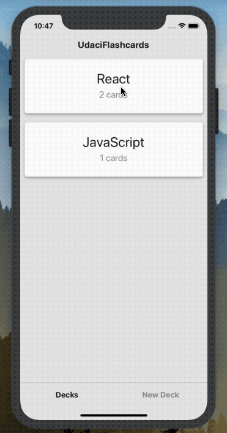

# UdaciCards
UdaciCards is a mobile application (iOS and Android) that allows users to study collections of flashcards. Users are able to create different categories of flashcards called "decks", add flashcards to those decks, then take quizzes on those decks.

## Installation
* git clone https://github.com/svlesiv/mobile-flashcards.git
* navigate to `mobile-flashcards` directory
* install all project dependencies with `yarn install`
* start the development server with `yarn start`

## Supported platforms
Tested on iOS 7 and Pixel 2 XL (emulator).